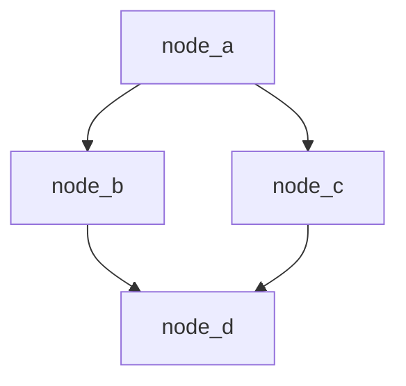

Here will be a little text about how to make everything properly

### Instantiate DAG

``` python
# FIXME write down philosophy 

import math
from scidag import DAG, Node
import asyncio
```

## Create functions that will be used as tasks in DAG

``` python
import random
def generate_random(start:int=10, finish:int=30)->int:
    return random.randint(start, finish)

def fib(n:int)->int:
    if n == 0:
        return 0
    elif n == 1 or n == 2:
        return 1
    else:
        return fib(n-1) + fib(n-2)

def fib_func(n:int)->int:
    return fib(n) 

def square_func(a:int)->int:
    return round(math.sqrt(a))

def sum_func(a:int, b:int)->int:
    return a + b
```

### Create DAG and Nodes

```python
dag = DAG()

node_a  = Node("node_a", generate_random)
node_b1 = Node("node_b", fib_func)
node_b2 = Node("node_c", square_func)
node_c  = Node("node_d", sum_func)
```



### Add nodes to DAG

```python
dag.add(node_a)
dag.add(node_b1)
dag.add(node_b2)
dag.add(node_c)
```

### Connect Nodes

```python
dag.connect("node_a", "node_b1.n")
dag.connect("node_a", "node_b2.a")
dag.connect("node_b1", "node_c.a")
dag.connect("node_b2", "node_c.b")
```

## Run DAG

``` python
dag.run()
```
